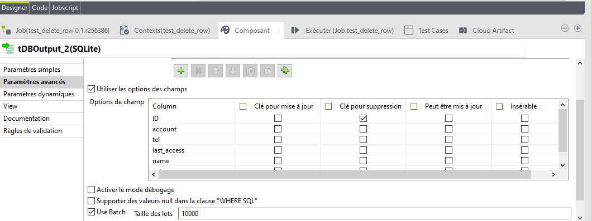

# TALEND_PRO

* [1. Cas d'utilisation : déplacement de fichiers pdf puis archivage puis suppression des fichiers d'origine](#depl)
* [2. Cas d'utilisation : job fils , job père](#perefils)
* [3. Gestion de l’erreur : OutOfMemory](#outofmemory)
* [4. Cas d'utilisation : Filtre des colonnes](#colonnes)
* [5. Cas d'utilisation : Filtre des lignes](#lignes)
* [6. Cas d'utilisation: insertion de plusieurs fichiers dans une base de donnée](#insertionfichiers)
* [7. Cas d'utilisation: update d'une table](#update)
* [8. Cas d'utilisation: suppression d'une ou des lignes d'une base de donnée avec un fichier pivot](#suppression)
* [9. Cas d'utilisation: extraction mensuelle ou trimestrielle](#mensuel_trim)
* [10. Cas d'utilisation: sélectionnez plusieurs fichiers csv ou txt pour faire qu'un fichier xls](#csv_xls)
* [11. Routines](#routines)
* [12. Cas d'utilisation: Insertion ou mise à jour d'une catégorie de produit](#cat)
* [13. Gestion de l’erreur : Error Handling](#handling)
* [14. tFlowMeter](#tFlowMeter)
* [15. tLogCatcher](#tLogCatcher)
* [16. tStatCatcher](#tLogCatcher)
* [17. POSTGRESQL](#postgresql)
* [18. JRE/JVM](#jrejvm)
* [19. Consommation API sans clé](#apia)
* [20. Planification d'un job sans TAC](#batch)
* [21. Envoie mail après erreur](#mailerror)
* [22. Création d'une routine](#routine)
* [23. Consommation SOAP](#SOAP)
* [24. tCreateTempory](#tcreatetempory)
* [25. Créer une table temporaire](#tcreatetable_temporary)
* [26. Suppression de fichier selon le nombre de jours](#deletefiles)

  
## 1. Cas : déplacement de fichiers pdf puis archivage puis suppression des fichiers d'origine<a class="anchor" id="dep1"></a>


## 2. Cas : Cas d'utilisation : job fils , job père<a class="anchor" id="perefils"></a>


On peut copier le shéma de sortie du job fils


## 3. Cas d'utilisation : Gestion de l’erreur OutOfMemory<a class="anchor" id="outofmemory"></a>

Il faut cocher sur la case "Utiliser les arguments JVM spécifiques

Puis changer la valeur "-Xmx 1024M" 


## 4. Cas d'utilisation : Filtre des colonnes<a class="anchor" id="colonnes"></a>
## 5. Cas d'utilisation : Filtre des lignes<a class="anchor" id="lignes"></a>
## 6. Cas d'utilisation: insertion de plusieurs fichiers dans une base de donnée<a class="anchor" id="insertionfichiers"></a>

## 7. Cas d'utilisation: update d'une table<a class="anchor" id="update"></a>
Il y a deux manières de faire un update :

- soit à partir d'un fichier client


Vous devez obligatoire choisir une clé pour faire la mise à jour et choisir les valeurs à mettre à jour.


- soit du composant TDBRow 


- soit avect tmap en forçant les valeurs :


Dans cet exemple, j'essaie de forcer avec une mise à jour le numéro identifiant(IDClub) du club d'un joueur de football.


Attention : vous devez spécifier au moins une colonne comme clé primaire sur laquelle baser les opérations Update ou alors Delete.

## 8. Cas d'utilisation: suppression d'une ou des lignes d'une base de donnée avec un fichier pivot<a class="anchor" id="suppression"></a>
Dans cet exemple, j'essaie de supprimer la ligne d'un consommateur à l'aide de son identifiant et de son nom mis dans un fichier.


Attention : comme pour une mise à jour, la suppression demande une clé de suppression. Pour ma part, j'ai choisi l'identifiant du joueur(ID).




## 9. Cas d'utilisation: extraction mensuelle ou trimestrielle <a class="anchor" id="mensuel_trim"></a>

tJava
```java
context.DateLancement =  TalendDate.getCurrentDate();

Date FirstDayMoisPrecedent = TalendDate.getFirstDayOfMonth(TalendDate.addDate(context.DateLancement,-1,"MM"));
 
context.FirstDayMoisPrecedent = TalendDate.formatDate("dd-MM-yyyy", FirstDayMoisPrecedent);

context.LastDayMoisPrecedent = TalendDate.formatDate("dd-MM-yyyy", TalendDate.getLastDayOfMonth(FirstDayMoisPrecedent)) ;

context.AnneeMoisPrecedent = TalendDate.getPartOfDate("YEAR", FirstDayMoisPrecedent);
```

## Cas d'utilisation: sélectionnez plusieurs fichiers csv ou txt pour faire qu'un fichier xls<a class="anchor" id="csv_xls"></a>

Pour le composant tFileOutputExcel, n'oubliez pas de cocher "Ajouter à la feuille existante". 
Pour le composant tInputDelimited_2, sélectionnez "...CURRENT_FILEPATH..." de "tFileList" pour le mettre dans le "Nom de fichier/Flux".


## Routines<a class="anchor" id="routines"></a>

```java
row1.FirstName+' '+row1.LastName 
StringHandling.DOWNCASE(row1.FirstName+row1.LastName)+"@gmail.fr" 
!Relational.ISNULL(row1.Prenom)&& !Relational.ISNULL(row1.Nom)&&!Relational.ISNULL(row1.SIRET) 
StringHandling.LEN(row1.Prenom)>5 &&StringHandling.LEN(row1.Nom)> 5 
StringHandling.LEN(row1.NSS) == 13 || StringHandling.LEN(row1.NSS) == 15
StringHandling.LEFT("chaîne à vérifier", n premiers caractères d'une chaîne de caractères)
StringHandling.RIGHT("chaîne à vérifier", n derniers caractères d'une chaîne de caractèr)
TalendDate.getDate("CCYY-MM-DD")
### Age actuel selon date de naissance
TalendDate.diffDateFloor(TalendDate.getCurrentDate(),row4.BirtthDay,"YYYY") 

row1.email.equals("xxx") / !row1.email.equals("xxx")
Relational.ISNULL(Xxxx) / ! Relational.ISNULL(Xxxx)
Xxxx.isEmpty() / ! Xxxx.isEmpty()
Xxxx.startsWith ("xxx") / Xxxx.endswith ("xxx")
Xxxx.contains ("xxx")

### Conversion d'un string en int
Integer.valueOf("xxxx") : 
### Conversion d'un int en string
String.valueOf(xxxx)
### Conversion d'un int ou float en string
variable.toString()
### Conversion d'un char en float
Float.parseFloat("xxxx")
### Conversion en BigDecimal (de string ou integer)
BigDecimal("xxxx" ou xxxx)
### Conversion d'un string en date en précisant le format du string
TalendDate.parseDate("dd/MM/yyyy","01/01/2021")
```

Dates
```java
System.out.println(TalendDate.getDate("yyyy-MM-dd'T'HH:mm:ss"));
System.out.println(TalendDate.getDate("yyyy-MM-dd'T'HH:mm:ss'Z'"));
System.out.println(TalendDate.formatDate("yyyy-MM-dd",TalendDate.parseDate("yyyy-MM-dd'T'HH:mm:ss","2024-01-12T00:00:00")));
System.out.println(TalendDate.formatDate("yyyy-MM-dd'T'HH:mm:ss",TalendDate.parseDate("yyyyMMdd","20240112")));
```

Output:
```
2024-04-17T11:13:01
2024-04-17T11:13:01Z
2024-01-12
2024-01-12T00:00:00
```
## Cas d'utilisation: Insertion ou mise à jour d'une catégorie de produit <a class="anchor" id="cat"></a>


## Gestion de l’erreur : Error Handling <a class="anchor" id="handling"></a>


## tFlowMeter<a class="anchor" id="tFlowMeter">
tFlowmeter renseigne sur le job en lui même (heure , nombre de ligne qui sont poussées au 
moment de l'execution , nom du projet , nom du job , nombre de ligne(count), version ...)


 
 
 ## tLogCatcher<a class="anchor" id="tLogCatcher"> 
 
 tLogCatcher a pour but de capter tous les exceptions du tWarn , du tDie et Java
 
 ## tStatCatcher<a class="anchor" id="tStatCatcher"> 
 Le tStatCatcher est basé sur le schéma prédéfini et regroupe les métadonnées de traitement du Job au niveau du Job et au niveau du composant, lorsque la case tStatCatcher Statistics est cochée.
 
Il y a une autre possibilté d'avoir tous les logs et stats du job: 


## POSTGRESQL<a class="anchor" id="postgresql"></a>
```sql
"SELECT 
  \""+context.postgreschinook1_Schema+"\".\"Artist\".\"ArtistId\", 
  \""+context.postgreschinook1_Schema+"\".\"Artist\".\"Name\"
FROM \""+context.postgreschinook1_Schema+"\".\"Artist\""
```

```sql
"  select Code_Depot_A,Code_Depot_N from TMS_Code_Depot where Code_Depot_A = \'"+context.new1+"\'"
```

mssql
```mssql
"SELECT \""+context.connection_ConfigESB_Schema+"\".SFT.Valeur
FROM \""+context.connection_ConfigESB_Schema+"\".SFT
WHERE \""+context.connection_ConfigESB_Schema+"\".SFT.Identifiant='"+context.Identifiant+"'"
```

```as400
"select *
 from M3EPRD.OCUSM1 CL 
 left outer join M1EPRD.OCUSAD on OPCONO=OKCONO and OPADRT=1 and OPADID='ADR1' 
 left outer join M1EPRD.OCHCUS on OSCONO=OKCONO and OSCUNO=OKCUNO and OSFVDT<='"+ ((String)globalMap.get("DateDernierTraitement")) +"' and OSLVDT>='"+ ((String)globalMap.get("DateDernierTraitement")) +"'
 left outer join M1EPRD. OCUSCH  on OQCONO=OKCONO and OQCUNO=OKCUNO and OQCRID='PFE' 
 where OKCONO=100 
 and (OKLMDT>='"+ ((String)globalMap.get("DateDernierTraitement")) +"') "
```
## JRE/JVM<a class="anchor" id="jrejvm"></a>

> :warning: **N'oubliez pas de redémarrer Talend après avoir choisi le JDK!**

## Consommation API sans clé<a class="anchor" id="apia"></a>


### API avec clé


## Planification d'un job sans TAC (Talend Administration Center)<a class="anchor" id="batch"></a>
On extraie le job puis après l'avoir dézippé, on lance le fichier bat dans un manager de tâche(Windows)


## Envoie mail après erreur<a class="anchor" id="mailerror"></a>


## Consommation SOAP <a class="anchor" id="mailerror"></a>
https://help.talend.com/r/fr-FR/7.3/webservice/webservice-scenario


2 ème exemple


## tCreateTempory<a class="anchor" id="tcreatetempory"></a>


## Créer une table temporaire<a class="anchor" id="#tcreatetable_temporary"></a>


## Suppression de fichier selon le nombre de jours <a class="anchor" id="deletefiles"></a>


Dans cet exemple, nous avons supprimé tous les fichiers qui ont été modifiés ou créés il y a plus de 30 jours.
