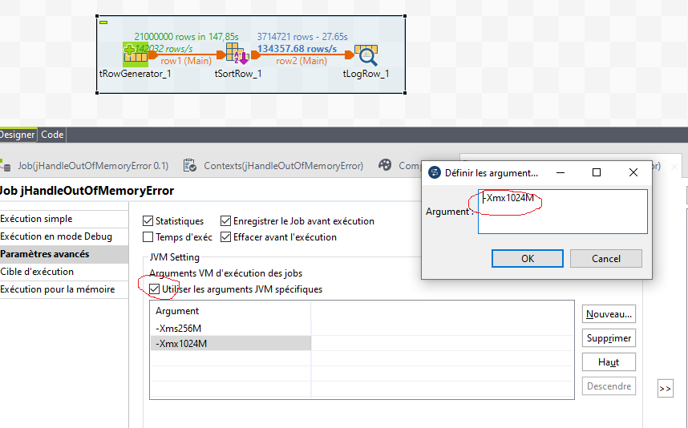

# TALEND_PRO3

* [1. Cas d'utilisation : déplacement de fichiers pdf puis archivage puis suppression des fichiers d'origine](#depl)
* [2. Cas d'utilisation : job fils , job père](#perefils)
* [3. Cas d'utilisation : Gestion de l’erreur OutOfMemory](#outofmemory)
* [4. Cas d'utilisation : Filtre des colonnes](#colonnes)
* [5. Cas d'utilisation : Filtre des lignes](#lignes)
* [6. Cas d'utilisation: insertion de plusieurs fichiers dans une base de donnée](#insertionfichiers)
* [7. Cas d'utilisation: update d'une table](#update)
* [8. Cas d'utilisation: suppression d'une ou des lignes d'une base de donnée avec un fichier pivot](#suppression)
* [9. Cas d'utilisation: extraction mensuelle ou trimestrielle](#mensuel_trim)
* [10.Cas d'utilisation: sélectionnez plusieurs fichiers csv ou txt pour faire qu'un fichier xls](#csv_xls)
* [11.Routines](#routines)
## 1. Cas : déplacement de fichiers pdf puis archivage puis suppression des fichiers d'origine<a class="anchor" id="dep1"></a>


## 2. Cas : Cas d'utilisation : job fils , job père<a class="anchor" id="perefils"></a>


On peut copier le shéma de sortie du job fils


## 3. Cas d'utilisation : Gestion de l’erreur OutOfMemory<a class="anchor" id="outofmemory"></a>

Il faut cocher sur la case "Utiliser les arguments JVM spécifiques

Puis changer la valeur "-Xmx 1024M" 


## 4. Cas d'utilisation : Filtre des colonnes<a class="anchor" id="colonnes"></a>
## 5. Cas d'utilisation : Filtre des lignes<a class="anchor" id="lignes"></a>
## 6. Cas d'utilisation: insertion de plusieurs fichiers dans une base de donnée<a class="anchor" id="insertionfichiers"></a>

## 7. Cas d'utilisation: update d'une table<a class="anchor" id="update"></a>
Il y a deux manières de faire un update :

- soit à partir d'un fichier client


Vous devez obligatoire choisir une clé pour faire la mise à jour et choisir les valeurs à mettre à jour.


- soit du composant TDBRow 


- soit avect tmap en forçant les valeurs :


Dans cet exemple, j'essaie de forcer avec une mise à jour le numéro identifiant(IDClub) du club d'un joueur de football.


Attention : vous devez spécifier au moins une colonne comme clé primaire sur laquelle baser les opérations Update ou alors Delete.

## 8. Cas d'utilisation: suppression d'une ou des lignes d'une base de donnée avec un fichier pivot<a class="anchor" id="suppression"></a>
Dans cet exemple, j'essaie de supprimer la ligne d'un consommateur à l'aide de son identifiant et de son nom mis dans un fichier.


Attention : comme pour une mise à jour, la suppression demande une clé de suppression. Pour ma part, j'ai choisi l'identifiant du joueur(ID).


## 9. Cas d'utilisation: extraction mensuelle ou trimestrielle <a class="anchor" id="mensuel_trim"></a>

tJava
```java
context.DateLancement =  TalendDate.getCurrentDate();

Date FirstDayMoisPrecedent = TalendDate.getFirstDayOfMonth(TalendDate.addDate(context.DateLancement,-1,"MM"));
 
context.FirstDayMoisPrecedent = TalendDate.formatDate("dd-MM-yyyy", FirstDayMoisPrecedent);

context.LastDayMoisPrecedent = TalendDate.formatDate("dd-MM-yyyy", TalendDate.getLastDayOfMonth(FirstDayMoisPrecedent)) ;

context.AnneeMoisPrecedent = TalendDate.getPartOfDate("YEAR", FirstDayMoisPrecedent);
```

## Cas d'utilisation: sélectionnez plusieurs fichiers csv ou txt pour faire qu'un fichier xls<a class="anchor" id="csv_xls"></a>

Pour le composant tFileOutputExcel, n'oubliez pas de cocher "Ajouter à la feuille existante". 
Pour le composant tInputDelimited_2, sélectionnez "...CURRENT_FILEPATH..." de "tFileList" pour le mettre dans le "Nom de fichier/Flux".


## Routines<a class="anchor" id="routines"></a>

```java
row1.FirstName+' '+row1.LastName 
StringHandling.DOWNCASE(row1.FirstName+row1.LastName)+"@gmail.fr" 
!Relational.ISNULL(row1.Prenom)&& !Relational.ISNULL(row1.Nom)&&!Relational.ISNULL(row1.SIRET) 
StringHandling.LEN(row1.Prenom)>5 &&StringHandling.LEN(row1.Nom)> 5 
StringHandling.LEN(row1.NSS) == 13 || StringHandling.LEN(row1.NSS) == 15
StringHandling.LEFT("chaîne à vérifier", n premiers caractères d'une chaîne de caractères)
StringHandling.RIGHT("chaîne à vérifier", n derniers caractères d'une chaîne de caractèr)
TalendDate.getDate("CCYY-MM-DD")
```
